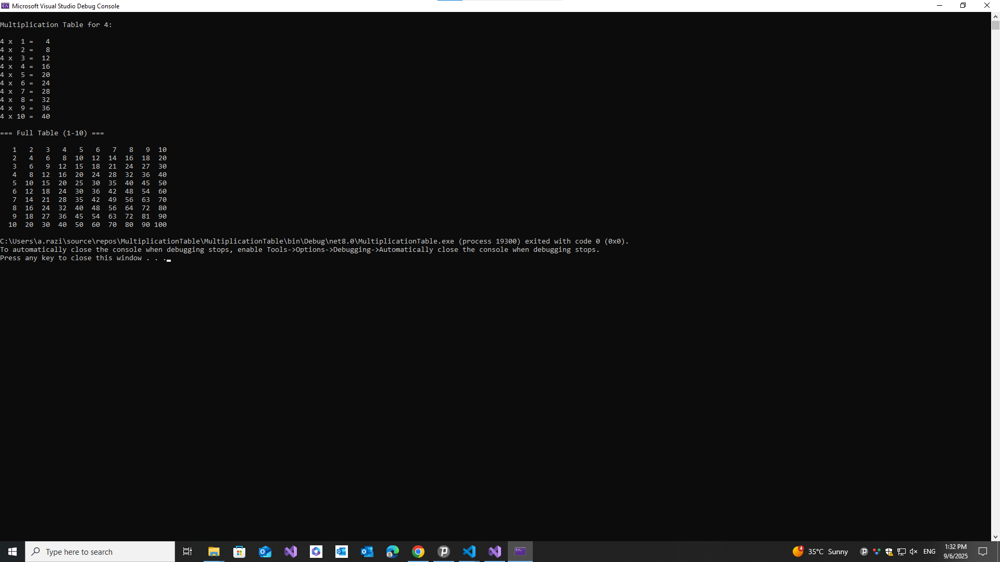

# ✖️ Multiplication Table Generator (C# Console App)

This is **Day 3** of my 30-Day C# Project-Based Learning Plan.  
The program generates multiplication tables for a given number and also prints the full 1–10 table in a formatted grid.  

---

## 🚀 Features
- Generate a table for any number (1–20 by default)  
- Display a complete multiplication table (1–10)  
- Nicely aligned tabular output  
- Input validation (no invalid or out-of-range numbers)  
- Beginner-friendly structure with reusable input methods  

---

## 🛠️ Technologies
- Language: **C#**  
- Framework: **.NET 6/7/8**  
- IDE: Visual Studio  

---

## 📸 Screenshots
| Game Overview |
|---------------|
|  |

---

---
## 📚 Learning Goals

This project covers:

- for loops and nested loops

- String formatting for alignment ({value,4})

- Input validation with int.TryParse

- Reusable methods (ReadInt)
